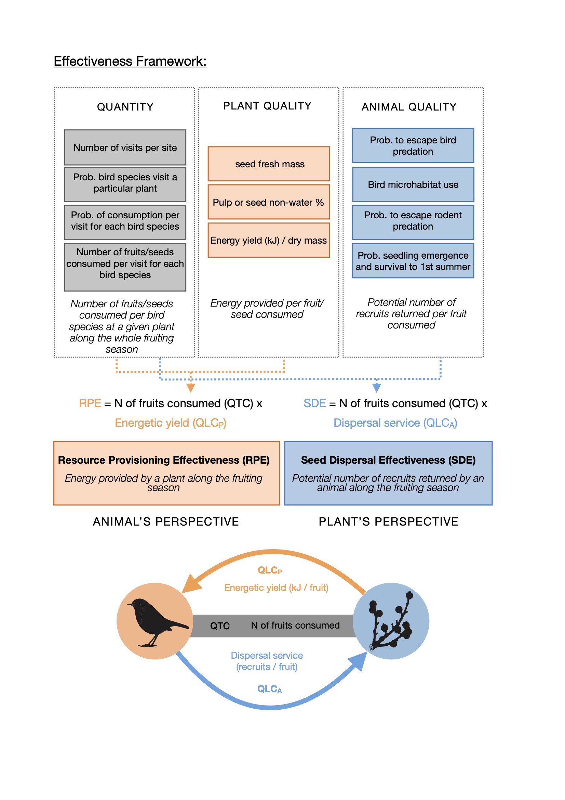
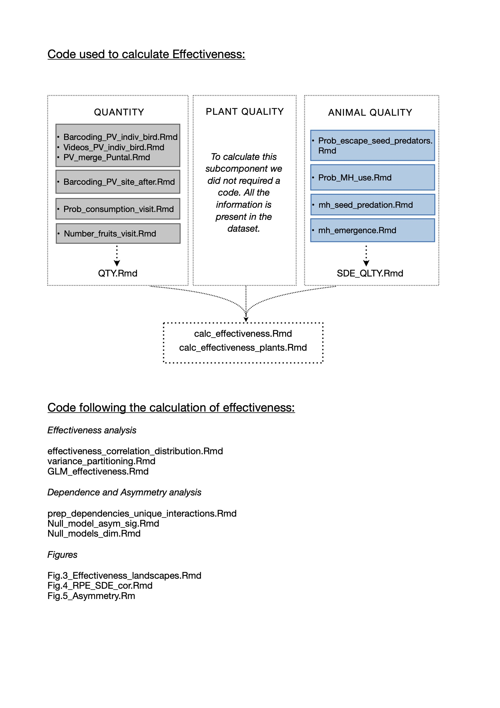

# Dataset and code for Mutualism Effectiveness and Reciprocity Manuscript

Manuscript title: 'Reciprocity and interaction effectiveness in generalized mutualisms among free-living species'

Authors: Elena Quintero, Francisco Rodríguez-Sánchez and Pedro Jordano.

Link manuscript Ecology Letters: <https://doi.org/10.1111/ele.14141> (available soon)

Link preprint BioRxiv: <https://doi.org/10.1101/2022.03.23.485462>

Link dataset in Dryad: <https://doi.org/10.5061/dryad.02v6wwq6n>

#### Suggested Citations:

*Manuscript citation:*

Quintero, E., Rodríguez-Sánchez, F. & Jordano, P. 2022. Reciprocity and interaction effectiveness in generalized mutualisms among free-living species. *Ecology Letters*, <https://doi.org/10.1111/ele.14141>

*Dataset citation:*

Quintero, E, Rodríguez-Sánchez, F. & Jordano, P. 2022. Data for the article "Reciprocity and interaction effectiveness in generalized mutualisms among free-living species", *Dryad*, Dataset, [https://doi.org/](https://doi.org/10.1111/ele.14141){.uri}[10.5061/dryad.02v6wwq6n](doi:10.5061/dryad.02v6wwq6n){.uri}

#### Licenses

Data: [CC0](https://creativecommons.org/share-your-work/public-domain/cc0/) - the authors respectfully request to be contacted or credited by researchers interested in the re-use of the data.

Code: MIT license (see MIT-license.txt)

#### Corresponding Author Information

-   Name: Elena Quintero
-   Email: [elenaquintero.qb\@gmail.com](mailto:elenaquintero.qb@gmail.com){.email}
-   Affiliation: Department of Integrative, Estación Biológica de Doñana - CSIC, Sevilla, Spain

## Description of the Data and file structure

Dataset and code present in this project are designed to calculate the effectiveness of the mutualistic service between frugivore animals and fruiting plants. The estimations follow the effectiveness framework (see Schupp et al 2017) and the code is structured based on these estimations.

#### Dataset description:

All the variables present within the datasets are described in the METADATA.csv. Data was collected in a shrubland dominated by *Pistacia lentiscus* in Doñana National Park (Huelva, Spain).

-   *bc_indiv_lentisc.csv* - DNA-barcoding identification of bird samples collected underneath individual plants of *Pistacia lentiscus*.

-   *cam_indiv_lentisc.csv* - Animal recorded visitation events to individual plant of *Pistacia lentiscus*.

-   *BirdFuncDat.txt* - Traits for all bird species extracted from Elton Traits.

-   *lentisc_feeding_rates.csv* - Number of fruits of *Pistacia lentiscus* that birds consumed per visit recorded through camera monitoring.

-   *fruit_characteristics.csv* - Fruit and seed weight of individual plants of *Pistacia lentiscus* at the study site.

-   *fruit_traits_HR_pedro.csv* - Water proportion found in fruits and seeds of *Pistacia lentiscus* at Hato Ratón site in Doñana NP. Data coming from Pedro Jordano's (co-author) PhD Thesis

-   *seed_predators_escape.csv* - Number of predated seeds of *Pistacia lentiscus* found at seed traps and number of intact seeds assigned through DNA-barcoding to granivorous birds.

-   *mh_combined_barcoding.csv* - DNA-barcoding identifications of bird samples collected at five different microhabitats - under *Pistacia lentiscus* conspecifics (PL) , under other fleshy fruited species (FR), under non-fleshy fruited species (NF), under pine trees (*Pinus pinea*; PP), and open ground areas (OA) 

-   *seed_predation.csv* - Results of *Pistacia lentiscus* seeds exposed to post-dispersal predation experiment at five different microhabitats.

-   *seedling_emergence.csv* - Results of *Pistacia lentiscus* seeds emergence and survival experiment at five different microhabitats.

-   *dron_areas.csv* - Individual *Pistacia lentiscus* plants' crown area measured using a dron.

Resulting dataset using the dataset above and generated using the codes below:

-   *asymm_null_models_patefield.rds* - Generated asymmetry values from randomized interactions matrices using Patefield null models (n=1000).

-   *asymm_null_models_vazquez.rds* - Generated asymmetry values from randomized interactions matrices using Vazquez null models (n=1000).

-   *bc.indiv.Madronas.Nvisits.post.long.rds* - Posterior distribution of the number of visits that bird did at individual plants of *Pistacia lentiscus* found at El Puntal site.

-   *bc.indiv.Puntal.Nvisits.post.long.rds* - Posterior distribution of the number of visits that bird did at individual plants of *Pistacia lentiscus* found at Laguna de las Madroñas site calculated using DNA-barcoding dataset.

-   *bc.Pvisit.sp.Madronas.rds* - Posterior distribution of the probability that a bird species visits an individual plant of *Pistacia lentiscus* in Laguna de las Madroñas site calculated using DNA-barcoding dataset.

-   *bc.Pvisit.sp.Puntal.rds* - Posterior distribution of the probability that a bird species visits an individual plant of *Pistacia lentiscus* in El Puntal site.

-   *cam.Pvisit.sp.Puntal.rds* - Posterior distribution of the probability that a bird species visits an individual plant of *Pistacia lentiscus* in Laguna de las Madroñas site calculated using camera dataset.

-   *consumed_fruit_mat.csv* - Matrix of animal-plant interactions where the values in the cell represent the total number of fruits that bird species consumed at individual plants of *Pistacia lentiscus.*

-   *Dependency_distribution.rds* - Mutual dependency estimation between animals and plants using effectiveness values and their asymmetry.

-   *Effectiveness_correlation_slope_CI_sd.rds* - Confidence interval for the regression model between the two-sided effectiveness values of individual *Pistacia lentiscus* plants - using only interactions with legitimate seed dispersers ("sd").

-   *Effectiveness_correlation_slope_CI.rds* - Confidence interval for the regression model between the two-sided effectiveness values of individual *Pistacia lentiscus* plants - using interactions with all bird consumers.

-   *Effectiveness_correlation_slopes_sd.rds* - Slope values for the regression model between the two-sided effectiveness values of individual *Pistacia lentiscus* plants - using only interactions with legitimate seed dispersers ("sd").

-   *Effectiveness_correlation_slopes.rds* - Slope values for the regression model between the two-sided effectiveness values of individual *Pistacia lentiscus* plants - using interactions with all bird consumers.

-   *Effectiveness_plants_no_pred.rds* - Effectiveness estimation and subcomponents for individual plants without considering seed predator birds.

-   *Effectiveness_plants.rds* - Effectiveness estimation and subcomponents for individual plants considering all birds consumers.

-   *effectiveness_summary.csv* - Summary values (median and mean) for effectiveness estimations and its subcomponents.

-   *effectiveness.rds* - Effectiveness estimation and subcomponents for all bird-individual plant pairwise interactions (unlike the datasets above referred to plants, this dataset is disaggregated by bird species, not pooling together their consumption).

-   *Nfruits_visit_post_long.rds* - Posterior distribution of the number of *Pistacia lentiscus* fruits consumed per visit estimated for each bird species.

-   *null_model_matrix_dimensions.rds* - Generated asymmetry values for interaction matrices of different sizes (20, 40 and 60 plants) using random subsets of individuals plant (n=1000 for matrix each size).

-   *null_models_patefield.rds* - Generated matrices (n=1000) following Patefield null models on the original animal-plant interaction matrix.

-   *null_models_vazquez.rds* - Generated matrices (n=1000) following Vázquez null models on the original animal-plant interaction matrix.

-   *Nvisits.site.rds* - Posterior distribution of the estimated total number of bird visits to all individual plants considered per site.

-   *Pdisperse.bird.mh.rd*s - Posterior distribution of the probability that a bird species deposits a seed at one the five considered microhabitats.

-   *Pfeed.post.rds* - Posterior distribution of the probability that bird consumes fruits when visiting a *Pistacia lentiscus* plant.

-   *pred.mh.post.long.rds* - Posterior distribution of the probability that dispersed seeds is predated when arriving a determined microhabitat.

-   *prob.escape.rds* - Posterior distribution of the probability that a seed escapes being predated when manipulated by a granivorous bird species.

-   *PV.Puntal.combined.rds* - Combined posterior distributions of the probability that a bird visits an individual plant in El Puntal site (i.e. combining bird visit probability estimated through DNA-barcoding and recording cameras).

-   *SDE_QLTY_mh.rds* - Estimated Quality component of effectiveness for bird species when taking seeds to each of the five microhabitats.

-   *SDE_QLTY_total.rds* - Estimated Quality component of effectiveness for bird species aggregating their quality at each of the five microhabitats.

-   *SDE_QTY_crop_consumed_wide.rds* - Estimated Quantity component of effectiveness (*i.e.* total number of fruits consumed) at individual plants (aggregating the consumption of all visiting bird species).

-   *SDE_QTY_Nfruits_escape.rds* - Estimated Quantity component of effectiveness corrected by the probability the seeds are dispersed (*i.e.* not predated by granivorus birds).

-   *surv.mh.post.rds* - Posterior distribution of the probability that a seed emerges and survives its first summer at five different microhabitats.

#### Code description:

The code is structured as following:

Below we provide a short description of the code:

-   *Barcoding_PV_indiv_bird.Rmd* - Bayesian analysis for estimating the probability that a bird visits an individual plant using the DNA-barcoding dataset.

-   *Barcoding_PV_site_after.Rmd* - Bayesian analysis for estimating the total number of bird visits at each study site (EP site and LM site).

-   *calc_effectiveness_plants.Rmd* - Code for calculating mutual partner effectiveness per individual plant (*i.e.* aggregating bird consumption at each plant).

-   *calc_effectiveness.Rmd* - Code for calculating mutual partner effectiveness per pair-wise interaction.

-   *effectiveness_correlation_distribution.Rmd* - Code for calculating correlation (i.e. reciprocity) between the two-sided effectiveness per individual plant.

-   *Fig.3_Effectiveness_landscapes.Rmd* - Code for generating figure 3 in the manuscript.

-   *Fig.4_RPE_SDE_cor.Rmd* - Code for generating figure 4 in the manuscript.

-   *Fig.5_Asymmetry.Rmd* - Code for generating figure 5 in the manuscript.

-   *GLM_effectiveness.Rmd* - GLM models to explore the effect of crop size, pulp fresh mass and plant area on the fruit consumption of bird species.

-   *mh_emergence.Rmd* - Bayesian analysis for estimating the probability of seed emergence at each microhabitat.

-   *mh_seed_predation.Rmd* - Bayesian analysis for estimating the probability of post-dispersal seed predation at each microhabitat.

-   *Null_model_asym_sig.Rmd* - Code for estimating the significance of the asymmetry in partner dependence encountered, that is, testing if the observed asymmetry distribution values would maintain when using randomized interaction matrices (*i.e.* matrices generated following Patefiled and Vazques null models).

-   *Null_models_dim.Rmd* - Code for testing the effect of matrix size in the calculation of asymmetry. Asymmetry is calculated for smaller matrices of different sizes to see if the observed values would change if we had sampled a different number of plants.

-   *Number_fruits_visit.Rmd* - Bayesian analysis for estimating the number of *P. lentiscus* fruits consumed per visit by bird species.

-   *prep_dependencies_unique_interactions.Rmd* - Code for estimating the two-sided dependence values between interacting partners and the asymmetry in their dependence.

-   *Prob_consumption_visit.Rmd* - Bayesian analysis for estimating the probability of fruit consumption during a bird visitation event.

-   *Prob_escape_seed_predators.Rmd* - Bayesian analysis for estimating the probability of seeds escaping granivorous birds pre-dispersal predation.

-   *Prob_MH_use.Rmd* - Bayesian analysis for estimating the probability of that birds deposit *Pistacia lentiscus* seeds at each of the five considered microhabitat.

-   *PV_merge_Puntal.Rmd* - Code where we merge the visitation probability at individual plants in El Puntal site estimated through DNA-barcoding and recording cameras.

-   *QTY.Rmd* - Code for estimating the Quantity component (*i.e.* total number of fruits consumed at individual plants).

-   *SDE_QLTY.Rmd* - Code for estimating the Quality component of SDE (*i.e.* bird's quality as dispersed).

-   *variance_partitioning.Rmd* - Code for analysing how much of the variance in effectiveness is due to the Quantity or to the Quality subcomponents.

-   *Videos_PV_indiv_bird.Rmd* - Bayesian analysis for estimating the visitation probability of birds at individual plants using cameras dataset.

## Sharing Information

Bird species' body mass data (file "BirdFuncDat.txt") was derived from the following source:

Wilman, H., Belmaker, J., Simpson, J., de la Rosa, C., Rivadeneira, M.M. and Jetz, W. (2014), **EltonTraits 1.0:** Species-level foraging attributes of the world's birds and mammals. Ecology, 95: 2027-2027. <https://doi.org/10.1890/13-1917.1> - <https://doi.org/10.6084/m9.figshare.c.3306933.v1>)

\-\-\-\-\-\--

References:

Schupp, E.W., Jordano, P. & Gómez, J.M. (2017). A general framework for effectiveness concepts in mutualisms. Ecol. Lett., 20, 577--590.\
